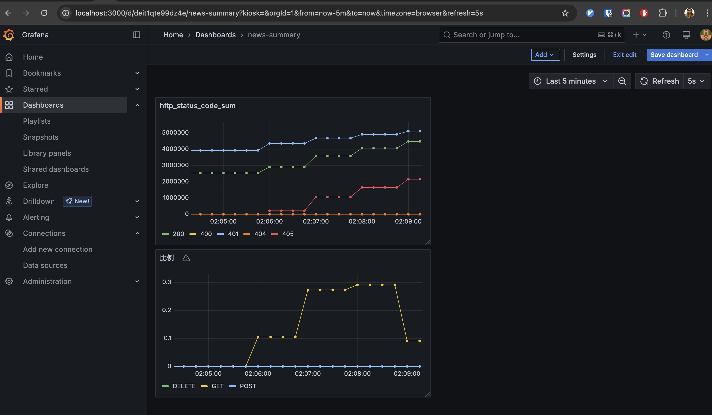
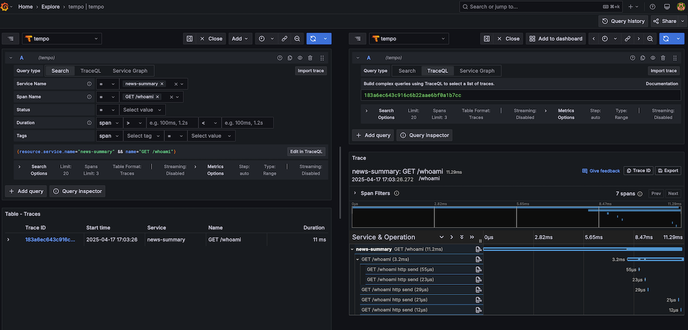
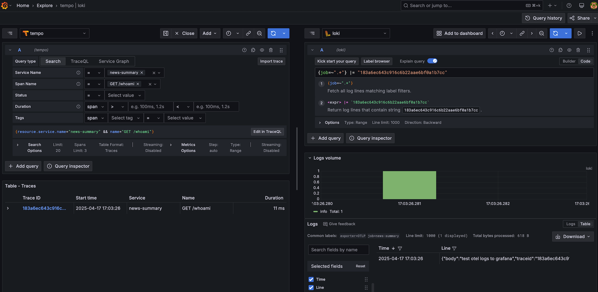

# 📰 api.rss.navydev.top


[](https://codecov.io/gh/wsgggws/api.rss.navydev.top)

**AI 生成个性化 RSS 摘要**，并在 [Bilibili](https://space.bilibili.com/472722204?spm_id_from=333.1007.0.0) 有合集分享，敬请期待！🚀

## 体验地址

[前端体验 (by React 18)](https://rss.navydev.top/)

---

## 🎯 **项目目标**

- 爬取用户订阅的 RSS 新闻源。
- 使用 AI 生成简短摘要。
- 根据用户阅读历史，个性化推荐相关新闻。
- 监控 API 请求量、摘要生成成功率。
- 设定告警规则，如 API 失败率高于 20% 触发警报。
- 支持单元测试及测试报告。
- 集成 CICD 流水线，自动化部署。

---

## 🚀 **核心功能**

- [x] 用户身份验证 & 登录
- [x] API 限流 & 身份认证（JWT）
- [x] 单元测试（Pytest）
- [x] 新闻订阅
- [x] 监控 Metrics（OpenTelemetry + otel-collector + Prometheus + Grafana）
- [x] 监控 Traces（OpenTelemetry + otel-collector + Tempo + Grafana）
- [x] 监控 Logs（OpenTelemetry + otel-collector + Loki + Grafana）
- [x] 监控 FastAPI-radar（实时请求，异常监控）
- [x] pydantic-settings（配置管理）
- [x] 新闻爬取 & 存储（Celery + asyncio + aiohttp + parsel）
- [x] AI 生成摘要（DeepSeek API）
- [x] CICD (Github actions 一键部署到 aliyun ECS 并启动)
- [ ] 错误追踪 （Sentry ）
- [ ] 个性化推荐（TF-IDF / 余弦相似度）
- [ ] Redis 缓存（新闻数据与个性化推荐）

---

## 🛠 **技术栈**

| **技术**            | **描述**                                              |
| ------------------- | ----------------------------------------------------- |
| **开发语言**        | Python 3.12                                           |
| **包管理**          | uv                                                    |
| **后端框架**        | FastAPI                                               |
| **数据库**          | PostgreSQL + SQLAlchemy（ORM）                        |
| **任务队列**        | Celery + aioredis（异步任务处理）                     |
| **配置管理**        | pydantic-settings                                     |
| **新闻爬取与解析**  | Asyncio + aiohttp + parsel                            |
| **单元测试**        | Pytest                                                |
| **AI 组件**         | TODO                                                  |
| **监控 Metrics**    | OpenTelemetry + otel-collector + Prometheus + Grafana |
| **监控 Traces**     | OpenTelemetry + otel-collector + Tempo + Grafana      |
| **监控 Logs**       | OpenTelemetry + otel-collector + Loki + Grafana       |
| **监控 请求与异常** | FastAPI-radar                                         |
| **错误追踪**        | Sentry                                                |
| **API 认证**        | JWT（身份验证）                                       |
| **API 限流**        | SlowAPI（请求频率限制）                               |
| **部署方式**        | Docker Compose                                        |

---

## 环境安装

## uv

```sh
curl -LsSf https://astral.sh/uv/install.sh | sh
```

---

## 🚀 **如何本地运行**

```sh
# 使用 poetry install python package
make install
```

```sh
# 本地启动 WebAPI
make local-run
```

```sh
# 启动 Celery beat and worker
make local-celery-start

# 停止 Celery beat and worker
make local-celery-stop
```

由于会使用到 AI 功能，可在 .env 文件里添加相关环境变量，
否则订阅的总结(summary_md) 字段将不会有内容生成, 其它功能正常

```.env
LLM_API_KEY="XXX"
LLM_BASE_URL="https://xxx" # Options 默认使用 DeepSeek
LLM_MODEL="YYY" # Options 默认使用 deepseek-chat
```

<details>
<summary>
OpenTelemetry-Instrument 启动, 并观测 Metrics, Traces, Logs
</summary>

```sh
# 注意不能添加 --reload 启动
make local-otel-run
```





</details>

---

## 🧪 **测试**

```sh
make test # 运行所有测试文件
make test ARGS="-vv -s" # 运行所有测试文件, -s 表示 print() 的内容也显示
make test ARGS="tests/test_whoami -vv -s" # 运行单个文件, 并显示输出
```

---

## 📡 **API 接口文档**

- 📌 本地 API 文档：[Swagger UI](http://127.0.0.1:8000/docs)
- 📌 线上 API 文档：[Swagger UI](https://rss.navydev.top/docs) | [ReDoc](https://rss.navydev.top/redoc) | [OpenAPI JSON](https://rss.navydev.top/openapi.json)
- 📌 后续将提供 Postman 请求案例
